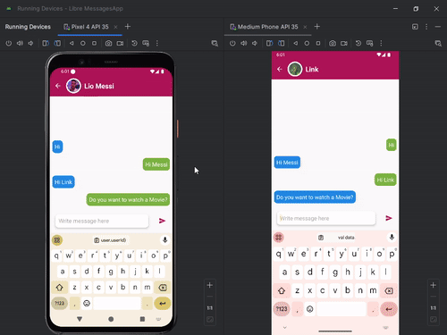

# Libre messages
Libre Messages is an app for chatting with other people using Kotlin and Firebase. This is a small project that I will be working on. It uses:
- Firebase Cloud Messaging V1
- Firebase Datastore
- Glide for image loading
- Image Picker
- XML with Data Binding

This app can:
- Send messages
- Receive notifications
- Authenticate users

Feel free to use it in your projects! :)

[Watch the preview in HD here](https://www.youtube.com/watch?v=qf-STpYEk1U)

